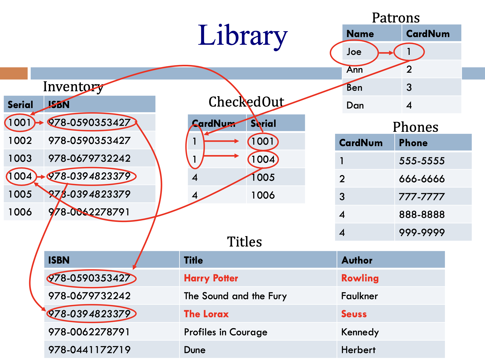

# LAB 1: Relational Model Practice

Jake Dame

17 May 2024

CS 6016: Database Systems & Applications

## Part 1

### 1. Tracking products by quantity

`StoreInventory [ __SKU__ (integer), ProductName (string), ProductQuantity (integer), ProductPrice (real) ]`

For simplicity, here, SKU is assumed to be a numerical type, but in the real world it could also include alphabetical characters.

Rationale:

- `SKU` will be the PK as it is unique and minimal, and probably stable
- `ProductName` may or may not be unique depending on how the retailer names things; unstable
- `ProductQuantity` is not unique
- `ProductPrice` is not unique

### 2. Tracking products by location within the store only

`ProductLocations [ __SKU__ (integer), __Aisle__ (integer), ProductName (string), ProductPrice (real) ]`

To reference the unique product AT the unique location, both `SKU` and `Aisle` need to be the PK.

For rationale, see this instance where no single attribute has unique values:

- `123234345, 4, Sprite 2L, 4.99`
- `123234345, 6, Sprite 2L, 4.99`
- `234345456, 6, Zingers 800pk, 19.99`

Also, we can be confident that we will not have duplicates because we know that the same product will not be displayed twice on the same aisle (according to the Lab instructions).

### 3. Keeping track of sales by associate at car dealership

We will need (at least) 3 tables here: one for `Cars`, one for `Salespeople`, and one to relate the two.

The only thing we are tracking in `Cars` is the dealership inventory (of cars), and VIN is unique, so it will be the PK:

`Cars [ __VIN__ (integer), CarMake (string), CarModel (string), CarYear (integer), CarColor (string) ]`

The only thing we are tracking in `Salespeople` is a roster of sales associates, and SSN is unique, so it will be the PK:

`Salespeople [ __SSN__ (integer), AssociateName (string) ]`

Now we need a table to relate salespeople and cars in a meaningful way, i.e., who is assigned to sell a particular car:

`SalesAssignments [ __VIN__(integer), __SSN__(integer) ]`

In this schema, VIN may not be unique, since two records may represent the same car assigned to two different salespeople. Additionally, SSN may not be unique because it is realistic that most salespeople will appear in the table multiple times as they are assigned to multiple cars. Therefore, the PK will be a composite key, consisting of `VIN` and `SSN`.

So, each record represents a single, unique "sales assignment". It would not make sense to have one person assigned to sell a car twice (unless you are planning on skipping town soon).

If a car is not assigned to anybody, it will not appear in `SalesAssignments`, although it will still exist in the `Cars` table.

## PART 2



For Patrons `[Name, CardNum]`:

```SQL
CREATE TABLE Patrons
(
    Name string,
    CardNum integer,
    PRIMARY KEY (CardNum)
)
```

`Name` is not unique because multiple patrons may have the same name.

`CardNum` is unique because duplicate card numbers are not issued.

For Phones `[CardNum, Phone]`:

```SQL
CREATE TABLE Phones
(
    CardNum integer,
    Phone integer,
    PRIMARY KEY (CardNum, Phone),
    FOREIGN KEY (CardNum) REFERENCES Patrons (CardNum)
)
```

`CardNum` is not unique because a patron may have multiple phone numbers.

`Phone` is not unique because a household may shared the same phone number.

Therefore, the only CK is `(CardNum, Phone)`.

For CheckedOut `[CardNum, Serial]`:

```SQL
CREATE TABLE CheckedOut
(
    CardNum integer,
    Serial integer,
    PRIMARY KEY (Serial)
    FOREIGN KEY (CardNum) REFERENCES Patrons (CardNum)
    FOREIGN KEY (Serial) REFERENCES Inventory (Serial)
)
```

`CardNum` is not unique because a patron may have multiple books checked out.

`Serial` is unique because each physical book in the library has a unique serial number, regardless of whether it has or hasn't the same ISBN (and author, title).

For Inventory `[Serial, ISBN]`:

```SQL
CREATE TABLE Inventory
(
    Serial integer,
    ISBN integer,
    PRIMARY KEY (Serial)
    FOREIGN KEY (ISBN) REFERENCES Titles (ISBN)
)
```

`Serial` is unique (see above).
`ISBN` is not unique because there may be multiple physical copies of the same book.

For Titles `[ISBN, Title, Author]`:

```SQL
CREATE TABLE Titles
(
    ISBN integer,
    Title string,
    Author string,
    PRIMARY KEY (ISBN),
    UNIQUE (Title, Author),
    FOREIGN KEY (ISBN) REFERENCES Inventory (ISBN)
)
```

`ISBN` is unique because this table does not track quantity of physical copies.
`Title` is not unique because, while rare, books by two different authors may have the same title.
`Author` is not unique because the library may have multiple books by the same author.

We can enforce uniqueness with `(Title, Author)` and because no one author writes two different books with the same title, and it is lacking the constraint from the `ISBN` attribute.

## PART 3

Here is the schema from earlier for the car dealership:

- `Salespeople [ __SSN__ (integer), AssociateName (string) ]`
- `Cars [ __VIN__ (integer), CarMake (string), CarModel (string), CarYear (integer), CarColor (string) ]`
- `SalesAssignments [ __VIN__(integer), __SSN__(integer) ]`

Here is what the tables could look like for the provided scenario:

**Arnold, trying to sell all Toyotas**

**Hannah, trying to sell all red cars**

**Steve, selling the Tesla**

    SalesAssignments [ 1, 111111111 ] # Arnold
    SalesAssignments [ 1, 222222222 ] # Hannah
    SalesAssignments [ 2, 111111111 ] # Arnold
    SalesAssignments [ 5, 222222222 ] # Hannah
    SalesAssignments [ 3, 333333333 ] # Steve

    Cars [ 1, "Toyota", "Tacoma", 2008, "Red" ]
    Cars [ 2, "Toyota", "Tacoma", 1999, "Green" ]
    Cars [ 3, "Tesla", "Model 3", 2018, "White" ]
    Cars [ 4, "Subaru", "WRX", 2016, "Blue" ]
    Cars [ 5, "Ford", "F150", 2004, "Red" ]

    Salespeople [ 111111111, "Arnold" ]
    Salespeople [ 222222222, "Hannah" ]
    Salespeople [ 333333333, "Steve" ]

VINs are usually very long, but for simplicity, they are single-digit numbers above.

The Subaru is not assigned to anyone; and both Hannah and Arnold are assigned to the 2008 Tacoma (as it is both red and a Toyota).

## PART 4

For the following instance:

| A1 | A2 | A3 |
|----|----|----|
|x   |4.0 |q   |
|y   |4.0 |p   |
|z   |3.1 |p   |
|z   |4.0 |p   |

Here is the diagram:

|Attribute Sets  |Superkey?  |Subsets                                        |Key?  |
|----------------|-----------|-----------------------------------------------|------|
|{A1}            |No         |{}                                             |No    |
|{A2}            |No         |{}                                             |No    |
|{A3}            |No         |{}                                             |No    |
|{A1, A2}        |Yes        |{A1}, {A2}                                     |Yes   |
|{A1, A3}        |No         |{A1}, {A3}                                     |No    |
|{A2, A3}        |No         |{A2}, {A3}                                     |No    |
|{A1, A2, A3}    |Yes        |{A1}, {A2}, {A3}, {A1, A2}, {A1, A3}, {A2, A3} |No    |

None of the 1-subsets are unique.

One of the 2-subsets is unique *and* minimal, and is therefore a key.

The full subset is unique but not minimal, and is therefore a superkey but it is *not* a key.

## PART 5

**For each statement below, indicate whether it is true or false, and briefly explain your reasoning in one or two sentences. XYZ are attributes, not values.**

### "If {x} is a superkey, then any set containing x is also a superkey."

True.

If {x} is a superkey, it is unique.

If any set contains {x}, that set will also be unique by virtue of {x}'s uniqueness.

### "If {x} is a key, then any set containing x is also a key."

False.

May or may not be true.

Any set containing {x} would be a *superkey*.

### "If {x} is a key, then {x} is also a superkey."

True.

If {x} is a key, then it is unique.

If {x} is unique, then it is a superkey.

### "If {x, y, z} is a superkey, then one of {x}, {y}, or {z} must also be a superkey."

False.

It *may* be true, but with the given information, we cannot say this is True.

{x,y,z} may be a subset of another set, and may be a key.

If it is a key, then none of its subsets are a superkey.

### "If an entire schema consists of the set {x, y, z}, and if none of the proper subsets of {x, y, z} are keys, then {x, y, z} must be a key."

False.

Even if the entire schema is the only potential key, we know nothing about the uniqueness of {x}, {y}, or {z}.

If all of them allow duplicates, this would be false. If one of them, however, was unique, it would be true.

Potential instance:

| x | y | z |
|---|---|---|
|1  |a  |8  |
|1  |b  |9  |
|1  |b  |9  |
