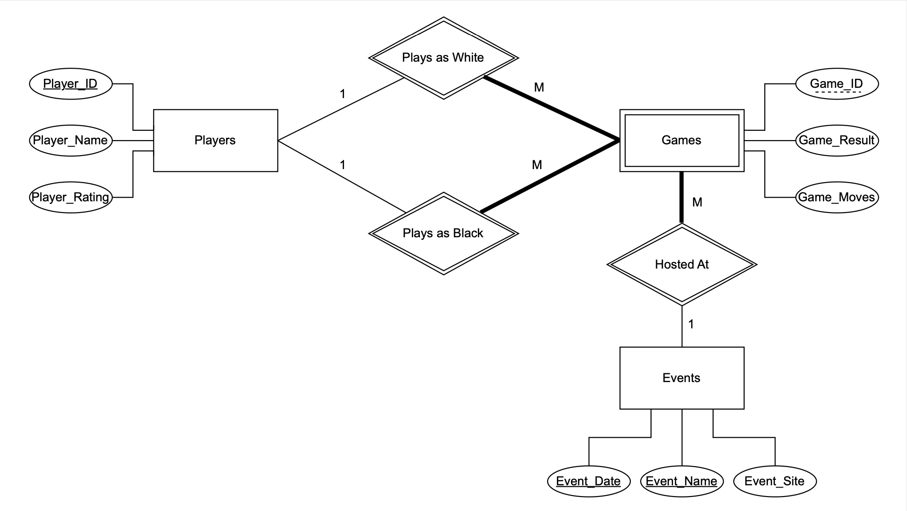

# Lab 2: ER Diagrams

Jake Dame  
30 May 2024  
CS 6016: Database Systems & Applications  
Dr. Nabil Makarem  

## Part 1: ER Diagram - Chess Events

**NOTE: For this assignment, I used `Game_ID` as the name for what the instructions called a game "round or number".**



We have three **entities**:
- **Players**
- **Events**
- **Games** (weak -- exists when **Players** *play* them at **Events**)

and three *relationships*:
- **Games** are *hosted at* **Events**
  - Many **Games** are *hosted* at at 1 **Event**
    - But many **Events** do not *host* 1 **Game**
- **Players** play **Games** (as the White side or as the Black Side)
  - 1 **Player** can *play* many **Games** - as the White Side
  - 1 **Player** can *play* many **Games** - as the Black Side
    - But 1 **Game** is not *played* by many **Players**


## Part 2: SQL Tables - Chess Events

The tables below are generally reflective of the ER diagram with some implementation differences:
- Additional attributes were included in the `Games` relation to define **Games** with **Players** (there are two FK's, that reference the `Players` relation)
- `Events` has an `Event_ID` merely to make a simpler, integer-type PK than having both `(Event_Name, Event_Date)` be the PK.

`Players[ __Player_ID__ (INT UNSIGNED), Player_Name (VARCHAR), Player_Rating (SMALLINT) ]`

```SQL
CREATE TABLE Players (
    Player_ID INT UNSIGNED NOT NULL AUTO_INCREMENT,
    Player_Name VARCHAR(255) NOT NULL,
    Player_Rating SMALLINT NOT NULL,
    PRIMARY KEY (Player_ID)
);
```

`Events[ __Event_ID__ (INT UNSIGNED), Event_Name (VARCHAR), Event_Date (DATE), Event_Site(VARCHAR) ]`

```SQL
CREATE TABLE Events (
    Event_ID INT UNSIGNED NOT NULL AUTO_INCREMENT,
    Event_Name VARCHAR(255) NOT NULL,
    Event_Date DATE NOT NULL,
    Event_Site VARCHAR(255) NOT NULL,
    PRIMARY KEY (Event_ID)
    UNIQUE KEY (Event_Name, Event_Date)
);
```

`Games[ __Game_ID__ (INT UNSIGNED), Game_Result (VARCHAR), Game_Moves (TEXT), White_Player (INT), Black_Player(INT), Event_ID (INT UNSIGNED)]`

```SQL
CREATE TABLE Games (
    Game_ID INT UNSIGNED NOT NULL AUTO_INCREMENT,
    Game_Result VARCHAR(12) NOT NULL,
    Game_Moves TEXT NOT NULL,
    White_Player INT UNSIGNED NOT NULL,
    Black_Player INT UNSIGNED NOT NULL,
    Event_ID INT UNSIGNED NOT NULL,
    PRIMARY KEY (Game_ID),
    FOREIGN KEY (White_Player) REFERENCES Players(Player_ID),
    FOREIGN KEY (Black_Player) REFERENCES Players(Player_ID),
    FOREIGN KEY (Event_ID) REFERENCES Events(Event_ID)
);
```